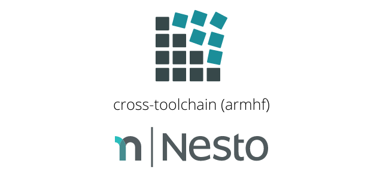

Cross-toolchain for Raspberry Pi (armhf)
======================

  

A cross-toolchain built using <a href="https://crosstool-ng.github.io/" target="_blank">crosstool-NG</a> that runs on x86-64 and targets the armhf architecture - maintained by Nesto and used for projects like <a href="https://github.com/nesto-software/ProxySuite">ProxySuite</a>.

Config
======

- Linux Kernel Source Tree: <a href="https://github.com/raspberrypi/linux">raspberrypi/linux</a>
- Linux Kernel Version: <a href="https://github.com/raspberrypi/linux/tree/rpi-5.10.y">rpi-5.10.y</a>

Scripts
=======

The following scripts are available inside the development container:

- `sudo toolchain-build`
- `sudo crosstool-upgradeconfig`
- `sudo crosstool-configure`

Versioning
==========

The cross-toolchain version corresponds to the raspberry pi Linux kernel version it was built against.